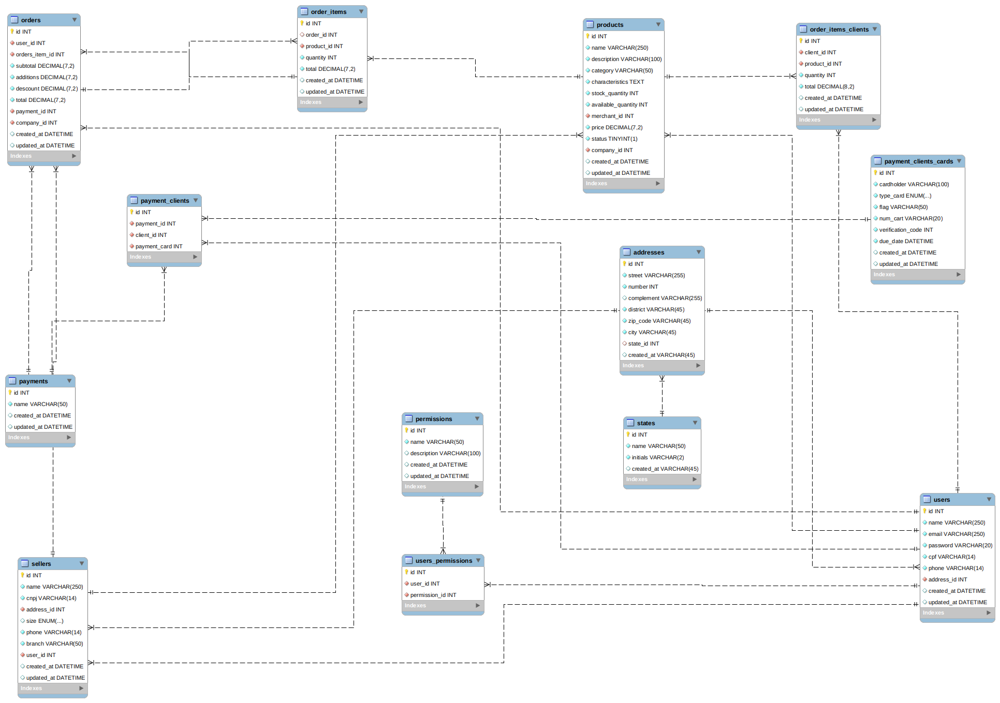

# Trabalho de conclusão de curso (TCC)

Desenvolvimento de um sistema para auxiliar os pequenos comerciantes em suas vendas

## Requisitos funcionais

### Usuários

✅ 🧪 Criar novo usuário  
✅ 🧪 Autenticar usuário  
✅ 🧪 Criar refresh token  
✅ 🧪 Mostrar usuário  
✅ Editar usuário  
✅ 🧪 Excluir usuário  
✅ Adicionar avatar  
✅ 🧪 Mandar e-mail para redefinir senha  
✅ Redefinir senha  
### Clientes

### Vendedores

### Serviços
- Listar todos os serviços de uma empresa
- Pesquisar serviços por nome ou parte do nome (usar o LIKE)
- Pesquisar serviço pelo id
- Listar serviços por categoria
- Cadastrar serviços
- Editar serviços
- Remover serviços

### Compras

## Regras de negócio

### Usuários

### Clientes

### Vendedores

### Produtos

### Compras

&nbsp;

## Diagrama ER

&nbsp;

